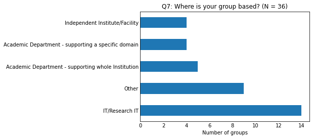
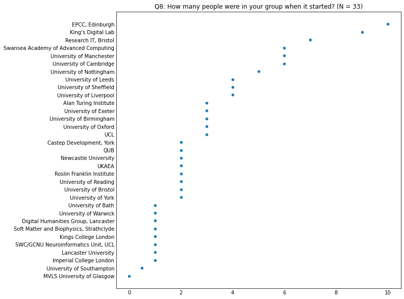

# RSE Group Leaders Survey 2023

    Questions  : 20
    Respondents - all           : 36
    Respondents - agreed sharing: 36

## Overview of the answers

    
    Q4: Is your group:
    
                                                                                          count  percentage
    The main RSE Group for the university/research organisation                              26          72
    An RSE Group for a specific subset/group within the university/research organisation      8          22
    An RSE Group for multiple universities/research organisations                             4          11

    

    

    
    Q7: Where is your group based?
    
                                                        count  percentage
    IT/Research IT                                         14          39
    Other                                                   9          25
    Academic Department - supporting whole Institution      5          14
    Academic Department - supporting a specific domain      4          11
    Independent Institute/Facility                          4          11

    

    

    
    Q15: Please rate the level of demand for your Group's services
    
                                                          count  percentage
    Demand greater than the number of RSEs                   17          47
    Demand significantly greater than the number of RSEs     14          39
    Demand is met by the number of RSEs                       4          11
    Demand is less than the number of RSEs                    0           0
    Demand is significantly less than the number of RSEs      0           0

    

    

    
    Q16: If demand for your services outstrips the number of RSEs, what causes this situation?
    
                                                                                                                     count  percentage
    Hiring processes are long-winded, so we're always behind the demand curve                                           21          58
    We lack the funding to make new positions available                                                                 12          33
    We can attract RSEs, but can't hire them because the salary and other benefits we can offer are not competitive      9          25
    We have funding, but we can't find RSEs to hire                                                                      7          19

    

    

