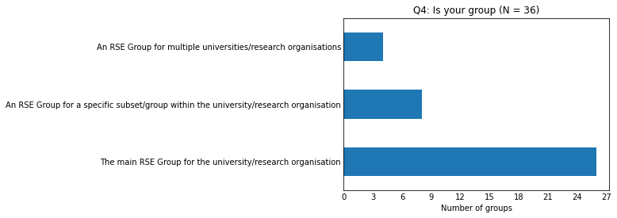
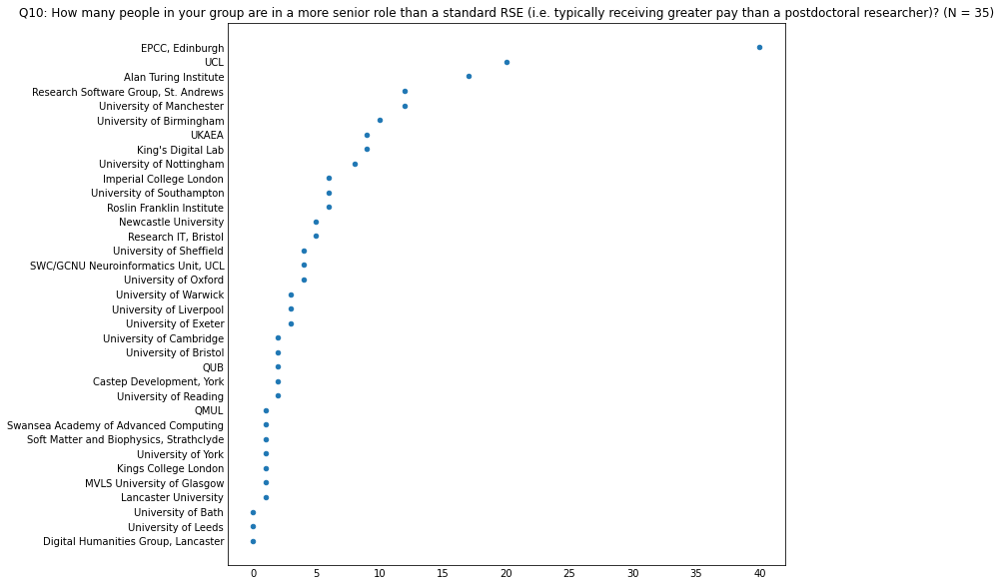

# RSE Group Leaders Survey 2023

    Questions  : 20
    Respondents - all           : 36
    Respondents - agreed sharing: 36

## Overview of the answers

    
    Q4: Is your group
    
                                                                                          count  percentage
    The main RSE Group for the university/research organisation                              26          72
    An RSE Group for a specific subset/group within the university/research organisation      8          22
    An RSE Group for multiple universities/research organisations                             4          11

    

    

    Q6: In what year was your group founded?

    

    

    
    Q7: Where is your group based?
    
                                                        count  percentage
    IT/Research IT                                         13          38
    Other                                                   8          24
    Academic Department - supporting whole Institution      5          15
    Academic Department - supporting a specific domain      4          12
    Independent Institute/Facility                          4          12

    

    

    Q8: How many people were in your group when it started?

    

    

    Q9: How many people are currently in your group in total?

    

    

    Q10: How many people in your group are in a more senior role than a standard RSE (i.e. typically receiving greater pay than a postdoctoral researcher)?

    

    

    Q11: How many people in your group are in a less senior role than a standard RSE (e.g. a junior RSE)?

    

    

    Q12: How many staff have left your group in the last two years?

    

    

    Q14: How many new RSEs positions have been added to your group in the last two years?

    

    

    
    Q15: Please rate the level of demand for your Group's services
    
                                                          count  percentage
    Demand greater than the number of RSEs                   16          48
    Demand significantly greater than the number of RSEs     13          39
    Demand is met by the number of RSEs                       4          12
    Demand is less than the number of RSEs                    0           0
    Demand is significantly less than the number of RSEs      0           0

    

    

    
    Q16: If demand for your services outstrips the number of RSEs, what causes this situation?
    
                                                                                                                     count  percentage
    Hiring processes are long-winded, so we're always behind the demand curve                                           20          61
    We lack the funding to make new positions available                                                                 11          33
    We can attract RSEs, but can't hire them because the salary and other benefits we can offer are not competitive      9          27
    We have funding, but we can't find RSEs to hire                                                                      7          21

    

    

