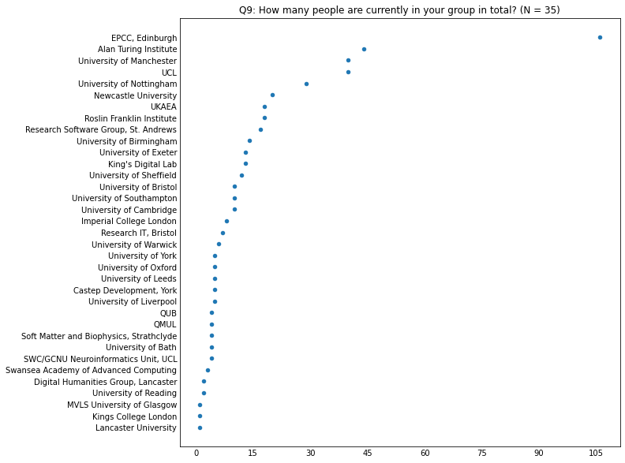
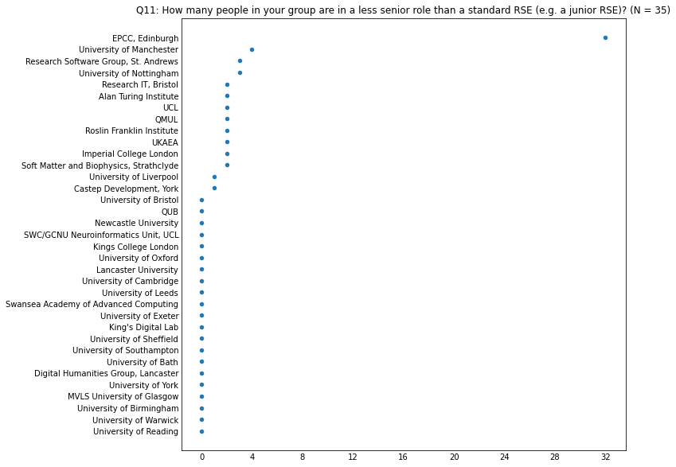

# RSE Group Leaders Survey 2023

    Questions  : 20
    Respondents - all           : 36
    Respondents - agreed sharing: 36

## Overview of the answers

    
    Q4: Is your group
    
                                                                                          count  percentage
    The main RSE Group for the university/research organisation                              24          73
    An RSE Group for a specific subset/group within the university/research organisation      7          21
    An RSE Group for multiple universities/research organisations                             4          12

    

    

    Q5: What is your position in the RSE Group?
                                                                                 count
    Head of RSE                                                                      7
    Director                                                                         3
    Head of Research Software Engineering                                            3
    Research Software Engineer                                                       3
    Senior Research Software Engineer                                                1
    Manage the Research It Team                                                      1
    Co-founder                                                                       1
    Research Software Engineering Group Leader                                       1
    Team Lead                                                                        1
    Leader                                                                           1
    Head of Research IT ( we have an RSE Team lead who sits below Head of)           1
    I am the academic director of the facility in which the RSE group is hosted      1
    Head Research Engineer                                                           1
    Head/Director of RSE                                                             1
    Team Manager                                                                     1
    Senior Research Software Analyst & Deputy Director                               1
    RSE team leader                                                                  1
    Group Leader                                                                     1
    Sole Member / Lead                                                               1
    Co-Leads                                                                         1
    Principal Architect (i.e. Senior RSE)                                            1
    Q6: In what year was your group founded?

    

    

    
    Q7: Where is your group based?
    
                                                        count  percentage
    IT/Research IT                                         13          39
    Other                                                   8          24
    Academic Department - supporting whole Institution      4          12
    Academic Department - supporting a specific domain      4          12
    Independent Institute/Facility                          4          12

    

    

    Q8: How many people were in your group when it started?

    

    

    Q9: How many people are currently in your group in total?

    

    

    Q10: How many people in your group are in a more senior role than a standard RSE (i.e. typically receiving greater pay than a postdoctoral researcher)?

    

    

    Q11: How many people in your group are in a less senior role than a standard RSE (e.g. a junior RSE)?

    

    

    Q12: How many staff have left your group in the last two years?

    

    

    Q13: Where did those staff go?

|                                         |                                                                                                                                                                                                                                                                                                                         |
|-----------------------------------------|-------------------------------------------------------------------------------------------------------------------------------------------------------------------------------------------------------------------------------------------------------------------------------------------------------------------------|
| Digital Humanities Group, Lancaster     |                                                                                                                                                                                                                                                                                                                         |
| Soft Matter and Biophysics, Strathclyde |                                                                                                                                                                                                                                                                                                                         |
| Castep Development, York                |                                                                                                                                                                                                                                                                                                                         |
| MVLS University of Glasgow              |                                                                                                                                                                                                                                                                                                                         |
| Kings College London                    |                                                                                                                                                                                                                                                                                                                         |
| University of York                      |                                                                                                                                                                                                                                                                                                                         |
| University of Reading                   |                                                                                                                                                                                                                                                                                                                         |
| University of Warwick                   |                                                                                                                                                                                                                                                                                                                         |
| QUB                                     |                                                                                                                                                                                                                                                                                                                         |
| Lancaster University                    |                                                                                                                                                                                                                                                                                                                         |
| SWC/GCNU Neuroinformatics Unit, UCL     |                                                                                                                                                                                                                                                                                                                         |
| University of Birmingham                | Position in industry                                                                                                                                                                                                                                                                                                    |
| University of Liverpool                 | retire                                                                                                                                                                                                                                                                                                                  |
| King's Digital Lab                      | One did not go to new position; one went to position in industry                                                                                                                                                                                                                                                        |
| University of Bath                      | Industry (2)                                                                                                                                                                                                                                                                                                            |
| Research IT, Bristol                    | Not RSEs  - 1 sysadmin left for promotion internally, 1 facilitator left for promotion externally as BA                                                                                                                                                                                                                 |
| University of Leeds                     | One became a teaching fellow in the School of Computing, the other moved to industry                                                                                                                                                                                                                                    |
| University of Southampton               | One became head of Kings RSE Group the other is going to the Warwick RSE Group                                                                                                                                                                                                                                          |
| University of Bristol                   | One left to become Head of RSE at another University. Another left for a good position in industry.                                                                                                                                                                                                                     |
| Imperial College London                 | 1: industry, 1: an embedded RSE team within Imperial (after a break)                                                                                                                                                                                                                                                    |
| University of Oxford                    | 1) Senior Lecturer position 2) position in industry 3) promotion to Senior RSE (+permanent)                                                                                                                                                                                                                             |
| Roslin Franklin Institute               | One left for industry + pay rise + more convenient commute
One left as they did not complete probation
One left for a similar level RSE role with similar pay in an area of the country they preferred.                                                                                                                                                                                                                                                                                                                         |
| Newcastle University                    | One to industry, two to other institutions                                                                                                                                                                                                                                                                              |
| University of Cambridge                 | research in Europe (2x), industry (1x)                                                                                                                                                                                                                                                                                  |
| University of Exeter                    | 3 left to industry, 1 transferred to a sys admin role in the university                                                                                                                                                                                                                                                 |
| University of Manchester                | 1x internal move, 1x another University, 2x industry                                                                                                                                                                                                                                                                    |
| University of Sheffield                 | Industry x 2, Other groups/roles x2                                                                                                                                                                                                                                                                                     |
| UKAEA                                   | Position in industry: 2
Different research position at another institution: 1
Different internal research position: 1                                                                                                                                                                                                                                                                                                                         |
| Swansea Academy of Advanced Computing   | 1 to industry, 1 to be RSE another project in the university, three to other institutions' RSE teams                                                                                                                                                                                                                    |
| UCL                                     | 1 postdoc, 3 industry (1 SE, 1 training, 1 RSE-like), 1 research institute, 1 uni spin-out; 3 moved country                                                                                                                                                                                                             |
| Alan Turing Institute                   | 1 internal move to domain-focussed data science team at Turing. 2 to MSc/PhD. 2 to academic PDRA/Lecturer. 5 to RSE/Data Science roles in industry. One academic and one industry moves were to more senior roles, the rest of them were lateral moves (including 2 shortly after promotion to Senior within the team). |
| University of Nottingham                | 6 to industry, 1 to NHS, 1 to further study, 1 transferred to Central IT team, 1 unknown                                                                                                                                                                                                                                |
| EPCC, Edinburgh                         |                                                                                                                                                                                                                                                                                                                         |

    Q14: How many new RSEs positions have been added to your group in the last two years?

    

    

    
    Q15: Please rate the level of demand for your Group's services
    
                                                          count  percentage
    Demand greater than the number of RSEs                   16          48
    Demand significantly greater than the number of RSEs     13          39
    Demand is met by the number of RSEs                       4          12
    Demand is less than the number of RSEs                    0           0
    Demand is significantly less than the number of RSEs      0           0

    

    

    
    Q16: If demand for your services outstrips the number of RSEs, what causes this situation?
    
                                                                                                                     count  percentage
    Hiring processes are long-winded, so we're always behind the demand curve                                           20          61
    We lack the funding to make new positions available                                                                 11          33
    We can attract RSEs, but can't hire them because the salary and other benefits we can offer are not competitive      9          27
    We have funding, but we can't find RSEs to hire                                                                      7          21

    

    

