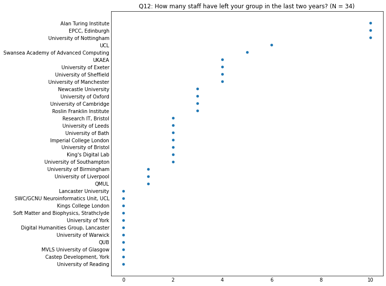
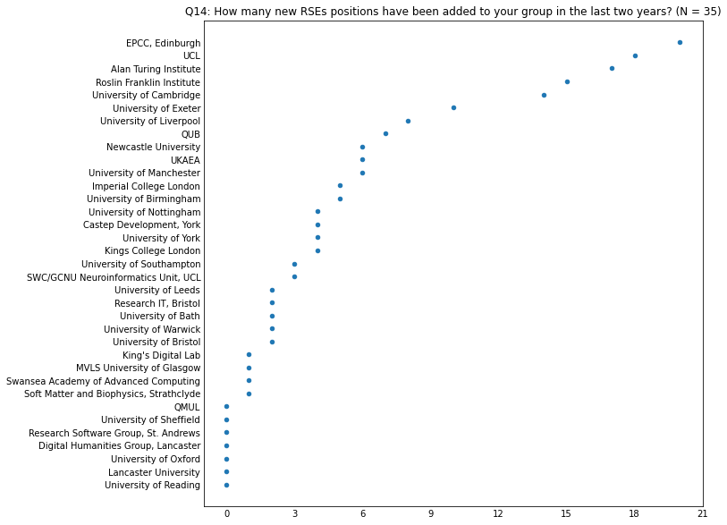
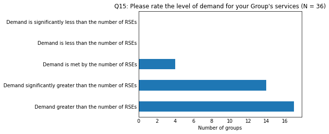

# RSE Group Leaders Survey 2023

    Questions  : 20
    Respondents - all           : 36
    Respondents - agreed sharing: 36

## Overview of the answers

    
    Q4: Is your group
    
                                                                                          count  percentage
    The main RSE Group for the university/research organisation                              26          72
    An RSE Group for a specific subset/group within the university/research organisation      8          22
    An RSE Group for multiple universities/research organisations                             4          11

    

    

    Q5: What is your position in the RSE Group?
                                                                                 count
    Head of RSE                                                                      7
    Director                                                                         3
    Head of Research Software Engineering                                            3
    Research Software Engineer                                                       3
    Team Lead                                                                        1
    I am the academic director of the facility in which the RSE group is hosted      1
    Principal Architect (i.e. Senior RSE)                                            1
    Sole Member / Lead                                                               1
    Group Leader                                                                     1
    RSE team leader                                                                  1
    Manage the Research It Team                                                      1
    Head of Research IT ( we have an RSE Team lead who sits below Head of)           1
    ? Trying to restart it                                                           1
    Senior Research Software Analyst & Deputy Director                               1
    Senior Research Software Engineer                                                1
    Leader                                                                           1
    Research Software Engineering Group Leader                                       1
    Co-Leads                                                                         1
    Team Leader                                                                      1
    Head/Director of RSE                                                             1
    Co-founder                                                                       1
    Group leader                                                                     1
    Head Research Engineer                                                           1
    Team Manager                                                                     1
    Q6: In what year was your group founded?

    

    

    
    Q7: Where is your group based?
    
                                                        count  percentage
    IT/Research IT                                         13          38
    Other                                                   8          24
    Academic Department - supporting whole Institution      5          15
    Academic Department - supporting a specific domain      4          12
    Independent Institute/Facility                          4          12

    

    

    Q8: How many people were in your group when it started?

    

    

    Q9: How many people are currently in your group in total?

    

    

    Q10: How many people in your group are in a more senior role than a standard RSE (i.e. typically receiving greater pay than a postdoctoral researcher)?

    

    

    Q11: How many people in your group are in a less senior role than a standard RSE (e.g. a junior RSE)?

    

    

    Q12: How many staff have left your group in the last two years?

    

    

    Q13: Where did those staff go?

|                                         |                                                                                                                                                                                                                                                                                                                         |
|-----------------------------------------|-------------------------------------------------------------------------------------------------------------------------------------------------------------------------------------------------------------------------------------------------------------------------------------------------------------------------|
| Digital Humanities Group, Lancaster     |                                                                                                                                                                                                                                                                                                                         |
| Soft Matter and Biophysics, Strathclyde |                                                                                                                                                                                                                                                                                                                         |
| Castep Development, York                |                                                                                                                                                                                                                                                                                                                         |
| MVLS University of Glasgow              |                                                                                                                                                                                                                                                                                                                         |
| Kings College London                    |                                                                                                                                                                                                                                                                                                                         |
| University of York                      |                                                                                                                                                                                                                                                                                                                         |
| University of Reading                   |                                                                                                                                                                                                                                                                                                                         |
| University of Warwick                   |                                                                                                                                                                                                                                                                                                                         |
| QUB                                     |                                                                                                                                                                                                                                                                                                                         |
| Lancaster University                    |                                                                                                                                                                                                                                                                                                                         |
| SWC/GCNU Neuroinformatics Unit, UCL     |                                                                                                                                                                                                                                                                                                                         |
| University of Birmingham                | Position in industry                                                                                                                                                                                                                                                                                                    |
| University of Liverpool                 | retire                                                                                                                                                                                                                                                                                                                  |
| King's Digital Lab                      | One did not go to new position; one went to position in industry                                                                                                                                                                                                                                                        |
| University of Bath                      | Industry (2)                                                                                                                                                                                                                                                                                                            |
| Research IT, Bristol                    | Not RSEs  - 1 sysadmin left for promotion internally, 1 facilitator left for promotion externally as BA                                                                                                                                                                                                                 |
| University of Bristol                   | One left to become Head of RSE at another University. Another left for a good position in industry.                                                                                                                                                                                                                     |
| University of Leeds                     | One became a teaching fellow in the School of Computing, the other moved to industry                                                                                                                                                                                                                                    |
| University of Southampton               | One became head of Kings RSE Group the other is going to the Warwick RSE Group                                                                                                                                                                                                                                          |
| Imperial College London                 | 1: industry, 1: an embedded RSE team within Imperial (after a break)                                                                                                                                                                                                                                                    |
| University of Oxford                    | 1) Senior Lecturer position 2) position in industry 3) promotion to Senior RSE (+permanent)                                                                                                                                                                                                                             |
| Roslin Franklin Institute               | One left for industry + pay rise + more convenient commute
One left as they did not complete probation
One left for a similar level RSE role with similar pay in an area of the country they preferred.                                                                                                                                                                                                                                                                                                                         |
| Newcastle University                    | One to industry, two to other institutions                                                                                                                                                                                                                                                                              |
| University of Cambridge                 | research in Europe (2x), industry (1x)                                                                                                                                                                                                                                                                                  |
| University of Exeter                    | 3 left to industry, 1 transferred to a sys admin role in the university                                                                                                                                                                                                                                                 |
| University of Manchester                | 1x internal move, 1x another University, 2x industry                                                                                                                                                                                                                                                                    |
| University of Sheffield                 | Industry x 2, Other groups/roles x2                                                                                                                                                                                                                                                                                     |
| UKAEA                                   | Position in industry: 2
Different research position at another institution: 1
Different internal research position: 1                                                                                                                                                                                                                                                                                                                         |
| Swansea Academy of Advanced Computing   | 1 to industry, 1 to be RSE another project in the university, three to other institutions' RSE teams                                                                                                                                                                                                                    |
| UCL                                     | 1 postdoc, 3 industry (1 SE, 1 training, 1 RSE-like), 1 research institute, 1 uni spin-out; 3 moved country                                                                                                                                                                                                             |
| Alan Turing Institute                   | 1 internal move to domain-focussed data science team at Turing. 2 to MSc/PhD. 2 to academic PDRA/Lecturer. 5 to RSE/Data Science roles in industry. One academic and one industry moves were to more senior roles, the rest of them were lateral moves (including 2 shortly after promotion to Senior within the team). |
| University of Nottingham                | 6 to industry, 1 to NHS, 1 to further study, 1 transferred to Central IT team, 1 unknown                                                                                                                                                                                                                                |
| EPCC, Edinburgh                         |                                                                                                                                                                                                                                                                                                                         |

    Q14: How many new RSEs positions have been added to your group in the last two years?

    

    

    
    Q15: Please rate the level of demand for your Group's services
    
                                                          count  percentage
    Demand greater than the number of RSEs                   16          48
    Demand significantly greater than the number of RSEs     13          39
    Demand is met by the number of RSEs                       4          12
    Demand is less than the number of RSEs                    0           0
    Demand is significantly less than the number of RSEs      0           0

    

    

    
    Q16: If demand for your services outstrips the number of RSEs, what causes this situation?
    
                                                                                                                     count  percentage
    Hiring processes are long-winded, so we're always behind the demand curve                                           20          61
    We lack the funding to make new positions available                                                                 11          33
    We can attract RSEs, but can't hire them because the salary and other benefits we can offer are not competitive      9          27
    We have funding, but we can't find RSEs to hire                                                                      7          21

    

    

    Q17: Roughly what percentage of your roles are open-ended/permanent?

|                                         |                                                                                                                                                                                                                                                                        |
|-----------------------------------------|------------------------------------------------------------------------------------------------------------------------------------------------------------------------------------------------------------------------------------------------------------------------|
| Digital Humanities Group, Lancaster     | 100%                                                                                                                                                                                                                                                                   |
| University of Sheffield                 | 100%                                                                                                                                                                                                                                                                   |
| University of Oxford                    | 100%                                                                                                                                                                                                                                                                   |
| University of Reading                   | 100%                                                                                                                                                                                                                                                                   |
| Lancaster University                    | 0                                                                                                                                                                                                                                                                      |
| Soft Matter and Biophysics, Strathclyde | 20%                                                                                                                                                                                                                                                                    |
| Swansea Academy of Advanced Computing   | 33                                                                                                                                                                                                                                                                     |
| MVLS University of Glasgow              | 100                                                                                                                                                                                                                                                                    |
| King's Digital Lab                      | 8%                                                                                                                                                                                                                                                                     |
| University of Leeds                     | 100%                                                                                                                                                                                                                                                                   |
| Research IT, Bristol                    | 100                                                                                                                                                                                                                                                                    |
| University of Bath                      | 25                                                                                                                                                                                                                                                                     |
| University of Bristol                   | 20% (all roles are "subject to funding", but we have always been able to attract funding)                                                                                                                                                                              |
| University of Warwick                   | 100%                                                                                                                                                                                                                                                                   |
| SWC/GCNU Neuroinformatics Unit, UCL     | 0                                                                                                                                                                                                                                                                      |
| University of Southampton               | 40% (This is because these people have been round long enough that the University has to make them open-ended)                                                                                                                                                         |
| Castep Development, York                | 20%                                                                                                                                                                                                                                                                    |
| University of Nottingham                | 30                                                                                                                                                                                                                                                                     |
| University of York                      | 100%                                                                                                                                                                                                                                                                   |
| Kings College London                    | 100                                                                                                                                                                                                                                                                    |
| University of Birmingham                | 86                                                                                                                                                                                                                                                                     |
| Imperial College London                 | 75%                                                                                                                                                                                                                                                                    |
| UKAEA                                   | 100                                                                                                                                                                                                                                                                    |
| University of Manchester                | 100%                                                                                                                                                                                                                                                                   |
| Newcastle University                    | 80%                                                                                                                                                                                                                                                                    |
| QUB                                     | 50                                                                                                                                                                                                                                                                     |
| University of Liverpool                 | 100%                                                                                                                                                                                                                                                                   |
| University of Exeter                    | 100%                                                                                                                                                                                                                                                                   |
| University of Cambridge                 | 50%                                                                                                                                                                                                                                                                    |
| Roslin Franklin Institute               | 50/50                                                                                                                                                                                                                                                                  |
| Alan Turing Institute                   | All posts are permanent with the exception of the Junior roles, which are initially 2 year fixed term training contracts. However, we hold an approved permanent role unfilled for each Junior and they are promoted into it when ready at either 12, 18 or 24 months. |
| UCL                                     | 100%                                                                                                                                                                                                                                                                   |
| EPCC, Edinburgh                         | 100%                                                                                                                                                                                                                                                                   |

    Q18: Does your Group have a cost recovery target? If so, what is that cost recovery target?

|                                         |                                                                                                                                                                                                                                |
|-----------------------------------------|--------------------------------------------------------------------------------------------------------------------------------------------------------------------------------------------------------------------------------|
| Digital Humanities Group, Lancaster     | Yes. 100%                                                                                                                                                                                                                      |
| University of Sheffield                 | 80% Not strict                                                                                                                                                                                                                 |
| University of Oxford                    | 100%                                                                                                                                                                                                                           |
| University of Reading                   |                                                                                                                                                                                                                                |
| Lancaster University                    |                                                                                                                                                                                                                                |
| Soft Matter and Biophysics, Strathclyde | No                                                                                                                                                                                                                             |
| Swansea Academy of Advanced Computing   | No formal target                                                                                                                                                                                                               |
| MVLS University of Glasgow              | Reaching 70% within five years; excludes Head of RSE (0% recovery target).                                                                                                                                                     |
| King's Digital Lab                      | 60% target for overall cost recovery (our costs currently include infrastructure costs in addition to staff) Over last couple of years we have actually only reached around 43%                                                |
| University of Leeds                     | 0                                                                                                                                                                                                                              |
| Research IT, Bristol                    | 60%                                                                                                                                                                                                                            |
| University of Bath                      |                                                                                                                                                                                                                                |
| University of Bristol                   | All RSEs except for the 2 core (myself and our free-at-the-point-of-use RSE) have to be 100% research funded (we operate a RSE-as-a-postdoc model). We need to secure funds before hiring, in the same way as hiring postdocs. |
| University of Warwick                   | 60%                                                                                                                                                                                                                            |
| SWC/GCNU Neuroinformatics Unit, UCL     | None                                                                                                                                                                                                                           |
| University of Southampton               | 100%                                                                                                                                                                                                                           |
| Castep Development, York                | Most positions are directly grant funded                                                                                                                                                                                       |
| University of Nottingham                | 100%                                                                                                                                                                                                                           |
| University of York                      | 80%                                                                                                                                                                                                                            |
| Kings College London                    | 70 (TBC)                                                                                                                                                                                                                       |
| University of Birmingham                | 40                                                                                                                                                                                                                             |
| Imperial College London                 | No. We aim for 70%, but it is not a hard boundary as salaries are underwritten.                                                                                                                                                |
| UKAEA                                   | Approx. 15 FTE (100% of staff costs, less 15% overheads/FATPU)                                                                                                                                                                 |
| University of Manchester                | No specific target, just to recover above the baseline which is a given.                                                                                                                                                       |
| Newcastle University                    | 80%                                                                                                                                                                                                                            |
| QUB                                     | 0 at present. Aim for it to rise to 100% but with underwriting from central uni to guarantee competitive salaries.                                                                                                             |
| University of Liverpool                 | None                                                                                                                                                                                                                           |
| University of Exeter                    | 80%                                                                                                                                                                                                                            |
| University of Cambridge                 | 90%                                                                                                                                                                                                                            |
| Roslin Franklin Institute               | No                                                                                                                                                                                                                             |
| Alan Turing Institute                   | 70-75% against funded projects.                                                                                                                                                                                                |
| UCL                                     | Not explicitly, but ~15% is core funded                                                                                                                                                                                        |
| EPCC, Edinburgh                         | 100%                                                                                                                                                                                                                           |

    Q19: Roughly what percentage of your group's time is spent on free at point of use activities. e.g. Training, Institutional support, free project support/consultancy.

|                                         |                                                                                                                                                                 |
|-----------------------------------------|-----------------------------------------------------------------------------------------------------------------------------------------------------------------|
| Digital Humanities Group, Lancaster     | 0%                                                                                                                                                              |
| University of Sheffield                 | 20% target. However, this is predominantly distributed through roles funded as in kind support for Tier 2 facilitates rather than spread evenly across the team |
| University of Oxford                    | 0%                                                                                                                                                              |
| University of Reading                   | 80%                                                                                                                                                             |
| Lancaster University                    | Currently 100%.  The aim is to move to more grant funded roles so that the role can outlive its current funding.                                                |
| Soft Matter and Biophysics, Strathclyde | 10%                                                                                                                                                             |
| Swansea Academy of Advanced Computing   | 40                                                                                                                                                              |
| MVLS University of Glasgow              | 40                                                                                                                                                              |
| King's Digital Lab                      | 12%                                                                                                                                                             |
| University of Leeds                     | 80%                                                                                                                                                             |
| Research IT, Bristol                    | 10%                                                                                                                                                             |
| University of Bath                      | 100%                                                                                                                                                            |
| University of Bristol                   | 10% (I have one core RSE who is wholly funded to provide this support)                                                                                          |
| University of Warwick                   | Currently very little. Around 10%. That should change with new appointments.                                                                                    |
| SWC/GCNU Neuroinformatics Unit, UCL     | 100%                                                                                                                                                            |
| University of Southampton               | 10%                                                                                                                                                             |
| Castep Development, York                | 10%                                                                                                                                                             |
| University of Nottingham                | <5%                                                                                                                                                             |
| University of York                      | 20%                                                                                                                                                             |
| Kings College London                    | 20 (TBC)                                                                                                                                                        |
| University of Birmingham                | 60                                                                                                                                                              |
| Imperial College London                 | 15%                                                                                                                                                             |
| UKAEA                                   | 15%                                                                                                                                                             |
| University of Manchester                | 10-20%                                                                                                                                                          |
| Newcastle University                    | <5%                                                                                                                                                             |
| QUB                                     | 10                                                                                                                                                              |
| University of Liverpool                 | 100%                                                                                                                                                            |
| University of Exeter                    | 10%                                                                                                                                                             |
| University of Cambridge                 | 10%                                                                                                                                                             |
| Roslin Franklin Institute               | 50%                                                                                                                                                             |
| Alan Turing Institute                   | 15-20%                                                                                                                                                          |
| UCL                                     | ~15% service to others, ~15% internal (Mgmt, ARC-led research, etc)                                                                                             |
| EPCC, Edinburgh                         | 50%                                                                                                                                                             |

    Q20: Anything else you would like to add?

|                                         |                                                                                                                                                                                                                                                                                                                                                                                                                                                                                                                                                                                                                                                                             |
|-----------------------------------------|-----------------------------------------------------------------------------------------------------------------------------------------------------------------------------------------------------------------------------------------------------------------------------------------------------------------------------------------------------------------------------------------------------------------------------------------------------------------------------------------------------------------------------------------------------------------------------------------------------------------------------------------------------------------------------|
| Digital Humanities Group, Lancaster     | At our highest point we had 6 fulltime RSEs, but we have scaled back in recent years whilst focussing on developing PGT. The scaling back was done by not replacing staff who voluntarily left for better paid jobs. With PGT in place, we now plan to increase our RSE activities again, which will require an increase in personnel. In my view, arguing the case for staff in advance of demand is a big problem, because the unpredictable nature of funding makes planning difficult when the model is 100% cost recovery to cover the wage bill.                                                                                                                      |
| University of Sheffield                 |                                                                                                                                                                                                                                                                                                                                                                                                                                                                                                                                                                                                                                                                             |
| University of Oxford                    | We are currently applying for central university funds to allow us to hire new RSEs and bring the cost recovery target down to 80% for the next 5 years, and have 20% time for training + new project development. This looks likely to go through.                                                                                                                                                                                                                                                                                                                                                                                                                         |
| University of Reading                   | Our RSE job roles & grades have only been officially recognised in December 2022.                                                                                                                                                                                                                                                                                                                                                                                                                                                                                                                                                                                           |
| Lancaster University                    |                                                                                                                                                                                                                                                                                                                                                                                                                                                                                                                                                                                                                                                                             |
| Soft Matter and Biophysics, Strathclyde |                                                                                                                                                                                                                                                                                                                                                                                                                                                                                                                                                                                                                                                                             |
| Swansea Academy of Advanced Computing   | The timing of the survey finds the team in a state of flux. The structure of the Supercomputing Wales project, plus internal bureaucracy, made it challenging to bring in other funding into the team, or even maintain the size of the team as the project was extended. The end of the project has seen the team move from being in principle central, to being more directly funded by a single faculty, and with significant uncertainty about the future. The inability of the institution to fund more than 36 months into the future (sometimes with less than a month's notice before when contracts would otherwise end) has led to a significant loss of talent. |
| MVLS University of Glasgow              |                                                                                                                                                                                                                                                                                                                                                                                                                                                                                                                                                                                                                                                                             |
| King's Digital Lab                      | Over last few years has been growing recognition at college level of the strategic importance of RSE capability. A central eResearch group has been set up to provide technical infrastructure, technical services, and RSE expertise for college staff engaged in research software related activities. KDL has close relations with this new group and is in process of moving all its VMs onto the eResearch infrastructure.                                                                                                                                                                                                                                             |
| University of Leeds                     | We currently do not have a head of RSE at Leeds and report directly to the Head of Research IT. I'd stress rather than being the main RSE group at Leeds we are the central RSE group, as there are satellite RSE teams at Leeds who support specific faculties.                                                                                                                                                                                                                                                                                                                                                                                                            |
| Research IT, Bristol                    | I wasn't clear if you wanted number just on the RSEs, there are other valuable staff in the team who support what we do, such as admin and sysadmin roles. I have included them in the numbers as they are integral to the functioning of the team.   
On question of expanding the team, there is an issue of overhead  - if it got any bigger it would need to be restructured. Also we are in a a bit of a chicken and egg situation, to grow we have to have an uncomfortably large pipeline and demonstrate we have more work than staff available, but that is stressful to staff.                                                                                                                                                                                                                                                                                                                                                                                                                                                                                                                                                                                                                                                                             |
| University of Bath                      | The RSE group is embedded in the Research Computing team at Bath, and the majority of group's resources have been utilised on broader Research Computing projects due to staff turnover in the Research Computing team, difficulty in recruiting and a lack of separation of the group from Research Computing team management. Whilst there is significant demand for RSEs, and funding in place on several projects, the team has not had the opportunity to work on these projects and recover costs. Only one of the RSEs in the group is in a central role, the rest are 1.0 FTE embedded on specific projects.                                                        |
| University of Bristol                   | I am noticing now that hiring is getting easier, although I am still seeing that industry positions are very attractive to existing staff. There is a major disconnect between the salary and career path possible in academia and what is possible in industry. Cost of living means that most academic posts are becoming less attractive. There are many structural problems and barriers with academia and research funding that make this problem hard to solve, especially as RSEs are already employed under better pay and conditions than PDRAs and many research fellows. The academic / public research system is very broken.                                   |
| University of Warwick                   | I've completed this for the main/original RSE group at Warwick. There are now other groups, e.g. a Digital Arts/Humanities RSE team led by Steve Ranford in our central IT function (2 senior RSEs and growing), plus the Stats/R focussed team lead by Heather Turner as part of her EPSRC RSE Fellowship.                                                                                                                                                                                                                                                                                                                                                                 |
| SWC/GCNU Neuroinformatics Unit, UCL     |                                                                                                                                                                                                                                                                                                                                                                                                                                                                                                                                                                                                                                                                             |
| University of Southampton               |                                                                                                                                                                                                                                                                                                                                                                                                                                                                                                                                                                                                                                                                             |
| Castep Development, York                |                                                                                                                                                                                                                                                                                                                                                                                                                                                                                                                                                                                                                                                                             |
| University of Nottingham                |                                                                                                                                                                                                                                                                                                                                                                                                                                                                                                                                                                                                                                                                             |
| University of York                      | Please include Philip Harrison as a co-contributor.  Phil is the RSE Team lead in the Research IT group.                                                                                                                                                                                                                                                                                                                                                                                                                                                                                                                                                                    |
| Kings College London                    | Might be useful to distinguish between IT and Research-IT in group location question                                                                                                                                                                                                                                                                                                                                                                                                                                                                                                                                                                                        |
| University of Birmingham                | These answers reflect a complex situation. For example some posts aim at 100% cost recovery, some 80% and some 0% - depending on details from when they were hired. Also - we can only meet demand because we hardly advertise our services. We don't really know the true demand.                                                                                                                                                                                                                                                                                                                                                                                          |
| Imperial College London                 |                                                                                                                                                                                                                                                                                                                                                                                                                                                                                                                                                                                                                                                                             |
| UKAEA                                   |                                                                                                                                                                                                                                                                                                                                                                                                                                                                                                                                                                                                                                                                             |
| University of Manchester                | Despite there being difficulties in hiring due to lower pay in the University sector, we have worked hard to remind people of the other benefits of working at a University that they don't get in the private sector which has worked quite well. Don't underestimate these. We have also found that people who are largely motivated by money aren't necessarily a good fit for the team anyway. Technical expertise off the shelf is also overrated and investing in your junior RSEs is important and a more viable option long term.                                                                                                                                   |
| Newcastle University                    |                                                                                                                                                                                                                                                                                                                                                                                                                                                                                                                                                                                                                                                                             |
| QUB                                     | Group was founded with 2 RSE fellows.  We have progressed to hiring 3 year-long interns, 1 FTE in MAP and funding for 3x FTE RSEs in cybersecurity. We are also working with the Post Doctoral Research Development centre who are mapping non-traditional, but essential, roles in the Uni to ensure fair attribution of credit and work.  RSEs will fit into this, hopefully redefining already existing roles.                                                                                                                                                                                                                                                           |
| University of Liverpool                 | Our group is a blend between software and platforms so may skew your results a bit. We have rebranded form Advanced Research Computing to Research IT and are in the process of growing the team from 4 to about 12-14. All core funded.                                                                                                                                                                                                                                                                                                                                                                                                                                    |
| University of Exeter                    | We have just concluded a piece of work looking at RSE career paths and have presented a set of recommendations to the university to improve routes for progression. I would be happy to share details in confidence but not for open publication at this time. When doing this work it would have been very helpful to have been able to reference guidelines, recommendations or best practise developed by the RSE Society.                                                                                                                                                                                                                                               |
| University of Cambridge                 | This response covers three subgroups (core team and two subject specific teams)                                                                                                                                                                                                                                                                                                                                                                                                                                                                                                                                                                                             |
| Roslin Franklin Institute               | This was filled in by Mark Basham (Science Director for AI) but should represent the RSE group as a whole, whose core leader is Laura Shemilt.

3 of our members are PhD students

For growth, we have grown as quickly as possible over the last few years, and spin up time has really been the deciding factor for new recruitment, but we defiantly have challenges around recruitment, and I see that there will be challenges around space and funding for growth to hit the level of demand.                                                                                                                                                                                                                                                                                                                                                                                                                                                                                                                                                                                                                                                                             |
| Alan Turing Institute                   | We're 34 people in post now, but have 10 people appointed but not yet started and approval to appoint 1 more. Numbers above are based on the 44 appointed staff. The unfilled post is  earmarked for another Junior. Demand for RSEs has exceeded supply since the team was founded in 2016 and we have grown every year except the first year of the pandemic. We've made 18 appointments this year but will be looking to maintain our current size over the next year as the Institute finalises its strategic plan for the next 5-10 years.                                                                                                                             |
| UCL                                     | We are not just an RSE group any more, but provide 4 professions collaborating on projects, teaching, etc. My answers above focus on those within the team who identify at least partially as RSEs. On the demand/supply question, we are also limited by ability to onboard staff and the rate of growth trajectory risk that the university is prepared to accept while offering all permanent posts. So we are now trying to reduce future demand to match a known growth curve rather than trying to chase ever growing demand!                                                                                                                                         |
| EPCC, Edinburgh                         |                                                                                                                                                                                                                                                                                                                                                                                                                                                                                                                                                                                                                                                                             |

